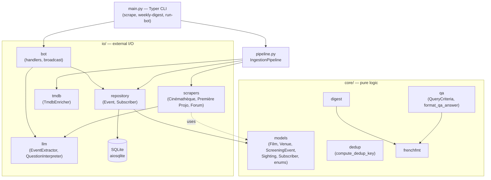
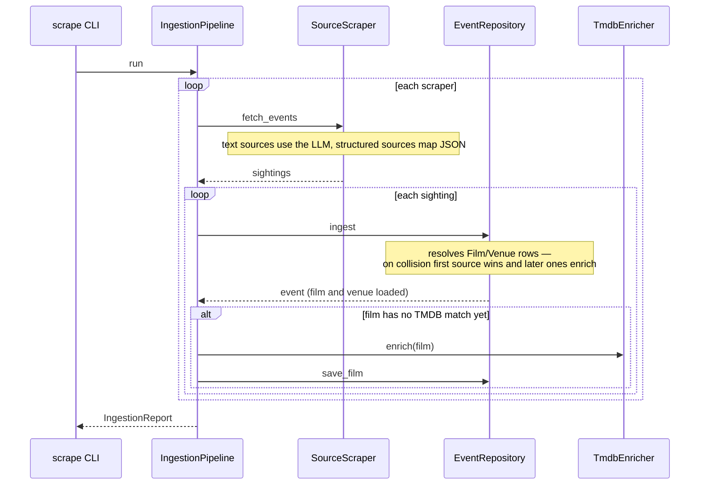
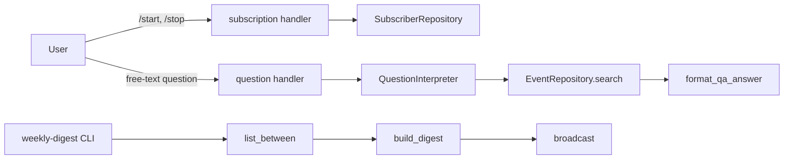

# Architecture

cine-event-bot aggregates special screenings in Paris/IDF from three scraped
sources, enriches them with TMDB metadata, persists a deduplicated set, and
exposes them through a Telegram bot (a weekly digest plus natural-language Q&A).

Everything is **async end to end**: an aiogram event loop (and `asyncio.run` for
the CLI) drives `httpx`, `aiosqlite`, and the Instructor/Ollama client without
blocking calls.

## Layers

The package follows a `core` / `io` split, with the entry points on top:

- **`core/`** — pure business logic, no I/O: domain models, deduplication key,
  digest and Q&A formatting, French date formatting, the Q&A criteria model.
- **`io/`** — everything that touches the outside world: the database, the
  scrapers, the LLM client, the TMDB client, the Telegram bot.
- **`pipeline.py`** and **`main.py`** — the application layer: `pipeline.py`
  orchestrates ingestion; `main.py` is the Typer CLI wiring dependencies and
  launching async work via `asyncio.run`.

## Data model

The persisted schema is normalized around the screening (see
[ADR 0006](decisions/0006-relational-schema-split.md)): `Film` (one row per
film, carrying the TMDB enrichment shared by all its screenings), `Venue` (one
row per venue, keyed by its normalized name), and `ScreeningEvent` referencing
both. Scrapers do not build rows directly — they produce `Sighting` objects
(extracted facts + provenance) that `EventRepository.ingest` resolves into
rows.

## Ingestion flow

`scrape` runs every scraper, ingests each sighting, and enriches its film when
it has no TMDB match yet. Whether a scraper used the LLM (text sources) or
mapped structured JSON (Première Projo) is internal to it, so the pipeline
stays uniform. A failing source is logged and skipped; a failing enrichment is
logged and the event stays persisted.

`IngestionReport` (`core/report.py`) records one `SourceOutcome` per scraper —
its event count, or that it failed. When `ADMIN_CHAT_ID` is configured, `scrape`
sends `build_admin_report`'s French summary to that chat: ✅ per source with its
count, ⚠️ when a source returns zero events (the early signal its HTML
changed), ❌ on a scrape failure — so a broken source is visible without
reading logs.

## Deduplication

A screening is identified by a deterministic key derived from its film, venue,
and start time (`core/dedup.py`), so the same event from two sources collapses
to one row. The merge policy on collision is **first-seen-wins, later-enriches**
(see [ADR 0002](decisions/0002-dedup-merge-strategy.md)).

## Telegram bot

`run-bot` polls Telegram. `/start` and `/stop` manage a digest subscription
(stored in the `Subscriber` table); any other message is treated as a question:
the `QuestionInterpreter` turns it into a `QueryCriteria`, the repository runs
the search, and the matches are formatted in French. `weekly-digest` broadcasts
the upcoming week's screenings to every active subscriber.

## Key decisions

Recorded as ADRs in [`docs/decisions/`](decisions/):

- [0001](decisions/0001-event-model-split.md) — three-way event model split
- [0002](decisions/0002-dedup-merge-strategy.md) — cross-source dedup merge
- [0003](decisions/0003-scraping-strategy.md) — thin scrapers, LLM structuring
- [0004](decisions/0004-rsc-extraction-and-pipeline.md) — RSC extraction + scraper output contract
- [0005](decisions/0005-drop-sortiraparis.md) — dropping Sortir à Paris
- [0006](decisions/0006-relational-schema-split.md) — Film/Venue/sighting schema split

See also [`scraping-strategy.md`](scraping-strategy.md) for how a new source is
classified and scraped.
