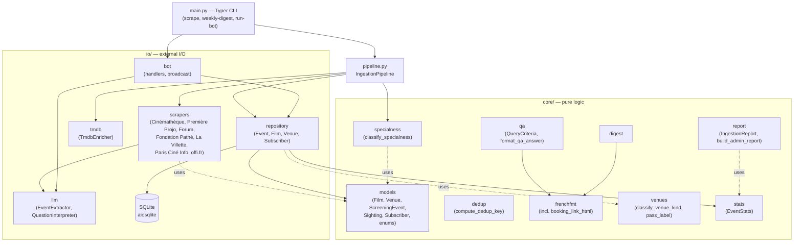
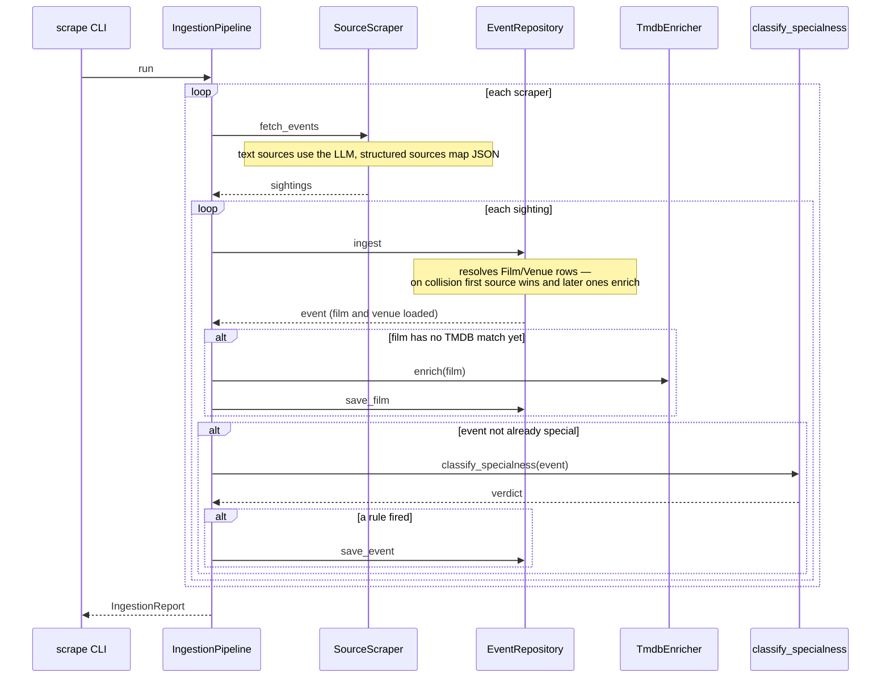
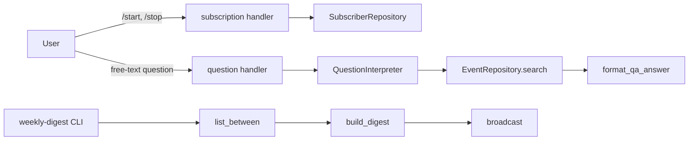

# Architecture

Lanterne aggregates cinema screenings in Paris/IDF from several scraped
sources, enriches them with TMDB metadata, persists a deduplicated set, and
exposes them through a Telegram bot (a weekly digest plus natural-language Q&A).

Every screening is stored, not only special ones — see
[ADR 0008](decisions/0008-drop-allocine-width-source.md) and
[`coverage-matrix.md`](coverage-matrix.md) for the sourcing strategy behind
this. `is_special` (upgraded by the rule-based specialness classifier,
[`core/specialness.py`](../src/lanterne/core/specialness.py) — see
[ADR 0009](decisions/0009-specialness-rules-only.md) for why it is rules
only, no LLM) separates "worth surfacing" from `event_type`, which now only
names *which* special category a screening belongs to and is `None` for an
ordinary screening. The weekly digest stays a curated, specials-only
artifact; the Q&A bot searches every stored screening.

Everything is **async end to end**: an aiogram event loop (and `asyncio.run` for
the CLI) drives `httpx`, `aiosqlite`, and the Instructor/Ollama client without
blocking calls.

## Layers

The package follows a `core` / `io` split, with the entry points on top:

- **`core/`** — pure business logic, no I/O: domain models, deduplication key,
  digest and Q&A formatting, French date formatting, the Q&A criteria model.
- **`io/`** — everything that touches the outside world: the database, the
  scrapers, the LLM client, the TMDB client, the Telegram bot.
- **`pipeline.py`** and **`main.py`** — the application layer: `pipeline.py`
  orchestrates ingestion; `main.py` is the Typer CLI wiring dependencies and
  launching async work via `asyncio.run`.

## Data model

The persisted schema is normalized around the screening (see
[ADR 0006](decisions/0006-relational-schema-split.md)): `Film` (one row per
film, carrying the TMDB enrichment shared by all its screenings), `Venue` (one
row per venue, keyed by its normalized name, carrying a `VenueKind` used as a
specialness prior), and `ScreeningEvent` referencing both. Scrapers do not
build rows directly — they produce `Sighting` objects (extracted facts +
provenance) that `EventRepository.ingest` resolves into rows.

`io/repository/` is a package, not a single module: `EventRepository`
(ingestion, dedup, event querying/reporting) composes a `FilmRepository` and
a `VenueRepository` (film- and venue-specific resolution, merging, and
enrichment, each its own file) to resolve the film/venue rows an incoming
sighting needs. `EventRepository` re-exposes their methods as thin delegates,
so every caller still only ever constructs a single
`EventRepository(session)` — the split is purely internal, fixing an earlier
SRP violation (one 674-line class mixing all four concerns) without changing
the public API.

`ScreeningEvent.event_type` is nullable (`None` for an ordinary screening);
`is_special` starts `True` at ingestion whenever a sighting already carries a
specific `EventType` — every source predating the all-screenings expansion
only ever produces a sighting once committed to one of the eight categories,
so this is exact by construction, not a placeholder — and starts `False` for
a width source reporting an ordinary showtime, upgraded later in the same
ingestion run by the specialness classifier once the film is enriched (see
below). `specialness_reasons` records why.

## Ingestion flow

`scrape` runs every scraper, ingests each sighting, enriches its film when it
has no TMDB match yet, then — since the film-age/rarity rule depends on that
enrichment — runs the rule-based specialness classifier
([ADR 0009](decisions/0009-specialness-rules-only.md)) on any screening not
already special. Whether a scraper used the LLM (text sources) or mapped
structured JSON (Première Projo) is internal to it, so the pipeline stays
uniform. A failing source is logged and skipped; a failing enrichment is
logged and the event stays persisted.

`IngestionReport` (`core/report.py`) records one `SourceOutcome` per scraper —
its event count, or that it failed. When `ADMIN_CHAT_ID` is configured, `scrape`
sends `build_admin_report`'s French summary to that chat: ✅ per source with its
count, ⚠️ when a source returns zero events (the early signal its HTML
changed), ❌ on a scrape failure — so a broken source is visible without
reading logs.

## Deduplication

A screening is identified by a deterministic key derived from its film, venue,
and start time (`core/dedup.py`), so the same event from two sources collapses
to one row. The merge policy on collision is **first-seen-wins, later-enriches**
(see [ADR 0002](decisions/0002-dedup-merge-strategy.md)).

## Telegram bot

`run-bot` polls Telegram. `/start` and `/stop` manage a digest subscription
(stored in the `Subscriber` table); any other message is treated as a question:
the `QuestionInterpreter` turns it into a `QueryCriteria`, the repository runs
the search, and the matches are formatted in French. `weekly-digest` broadcasts
the upcoming week's screenings to every active subscriber.

## Key decisions

Recorded as ADRs in [`docs/decisions/`](decisions/):

- [0001](decisions/0001-event-model-split.md) — three-way event model split
- [0002](decisions/0002-dedup-merge-strategy.md) — cross-source dedup merge
- [0003](decisions/0003-scraping-strategy.md) — thin scrapers, LLM structuring
- [0004](decisions/0004-rsc-extraction-and-pipeline.md) — RSC extraction + scraper output contract
- [0005](decisions/0005-drop-sortiraparis.md) — dropping Sortir à Paris
- [0006](decisions/0006-relational-schema-split.md) — Film/Venue/sighting schema split
- [0007](decisions/0007-paris-cine-info.md) — Paris Ciné Info: authenticated, hybrid-level source
- [0008](decisions/0008-drop-allocine-width-source.md) — dropping AlloCiné as the all-screenings width source
- [0009](decisions/0009-specialness-rules-only.md) — specialness classification: rules only, no LLM fallback

See also [`scraping-strategy.md`](scraping-strategy.md) for how a new source is
classified and scraped.
