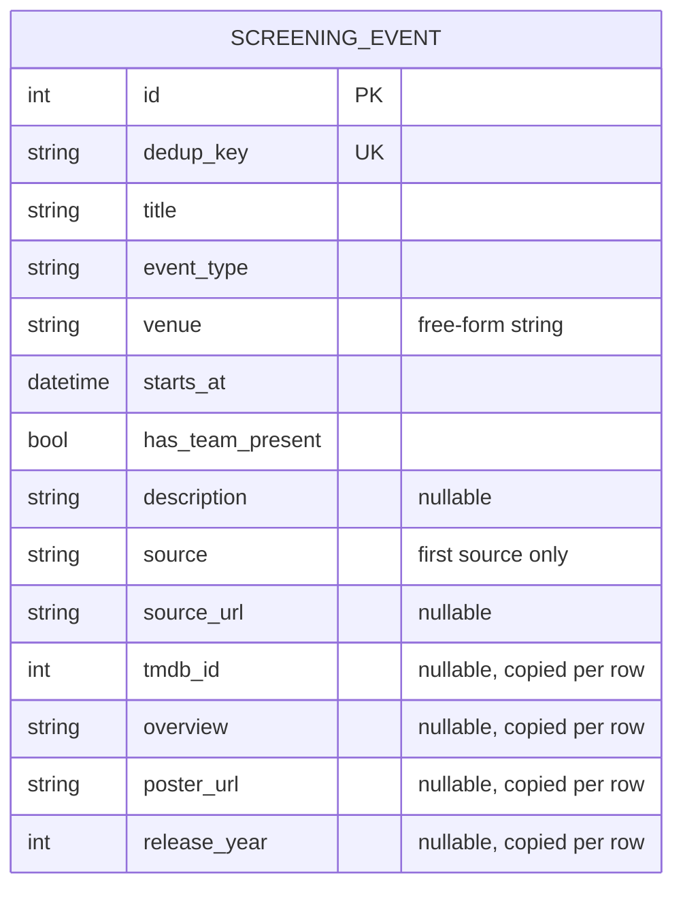
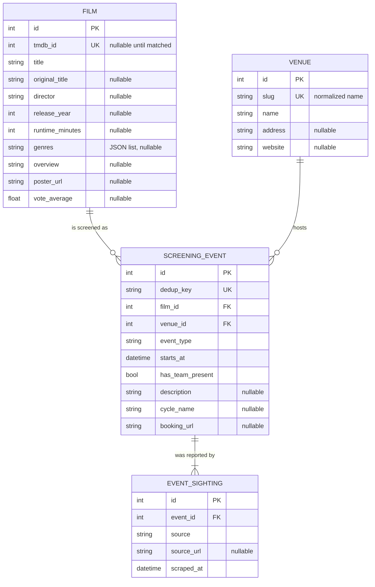

# 0006 — Split the flat event row into Film, Venue, and sightings

- Status: accepted
- Date: 2026-07-06

## Context

`ScreeningEvent` started as a single flat table: film fields, the venue as a
free-form string, TMDB enrichment columns, and a single `source`/`source_url`
pair all live on the event row. That shape was right for the MVP, but it now
blocks the three directions the project is heading in:

- **More sources** (UGC, Pathé, MK2, Le Grand Rex, La Villette, independent
  cinemas…): the same film screens many times across venues, so per-row TMDB
  copies multiply, and the "keep only the first source" provenance rule
  (ADR 0002) throws away information we now want.
- **Richer enrichment**: director, genres, runtime, and rating belong to the
  *film*, not to one screening of it. Venue metadata (address, website) belongs
  to the *venue*. Neither has a home in a flat row without duplicating it on
  every screening.
- **Evolvability**: adding a film- or venue-level attribute today means adding
  a column to the event table and backfilling every row.

## Decision

Normalize the schema into four tables around the screening (plus the unchanged
`Subscriber`), managed by Alembic migrations from now on (see the setup in
[docs/setup.md](../setup.md)):

- **`Film`** — one row per film, shared by all its screenings. Carries all
  TMDB enrichment: `tmdb_id` (unique, nullable until matched), `title`,
  `original_title`, `director`, `release_year`, `runtime_minutes`, `genres`
  (JSON list), `overview`, `poster_url`, `vote_average`. Films are matched by
  `tmdb_id` once enriched, by normalized title before that.
- **`Venue`** — one row per venue, keyed by a normalized `slug` derived from
  the announced name; `name` keeps the display form, `address` and `website`
  are optional enrichment.
- **`ScreeningEvent`** — the screening itself: `dedup_key` (unchanged
  computation: announced title + venue + start time), `film_id`, `venue_id`,
  `event_type`, `starts_at`, `has_team_present`, `description`, plus two new
  optional facts sources often provide: `cycle_name` (retrospective/festival
  cycle) and `booking_url`.
- **`EventSighting`** — one row per (event, source) pair: `source`,
  `source_url`, `scraped_at`. This supersedes the "we do **not** track the
  full set of sources" consequence of ADR 0002 — the concrete need that ADR
  deferred to (YAGNI) has arrived with the source expansion. The merge rules
  of ADR 0002 (OR on `has_team_present`, backfill of `description`) are kept.

### Before

### After

## Consequences

- **TMDB enrichment runs once per film**, not once per screening — fewer API
  calls, and a retrospective's twenty screenings share one enriched row.
- **Cross-source provenance is complete**: `stats` and the post-scrape report
  count sightings per source, and an event can show every source that listed
  it. ADR 0002's merge policy is unchanged; only its "single source kept"
  consequence is superseded.
- **Queries join**: the digest, Q&A search (title/overview text match now goes
  through `Film`), and stats read across tables instead of one. With SQLite
  and this volume the cost is negligible; the repositories keep the joins out
  of callers' sight.
- **Migrations become mandatory**: schema changes now go through Alembic
  instead of `reset-db` (which remains a dev convenience). This is the price
  of "evolvable" and it is deliberate.
- The `dedup_key` computation is untouched, so re-scraping existing data
  remains idempotent across the migration.
