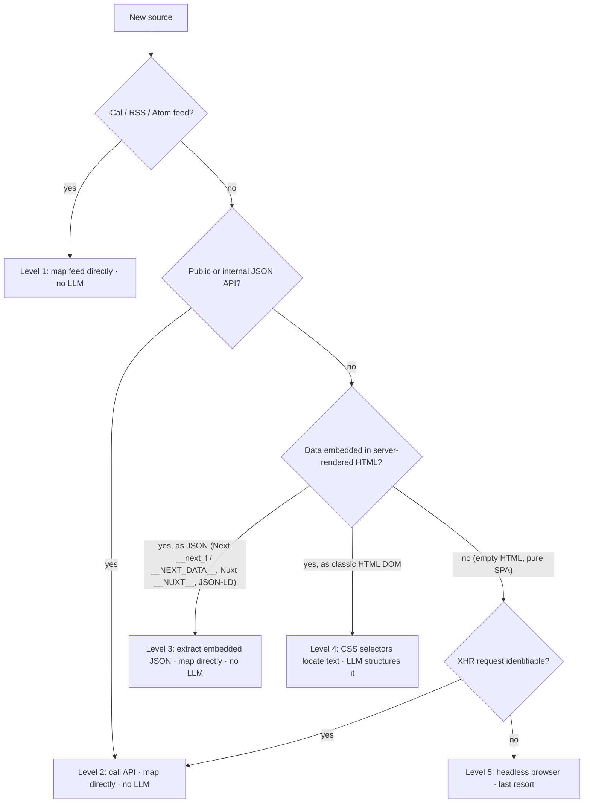

# Scraping strategy — choosing how to ingest a new source

This is the decision procedure to follow whenever a new source is added. The
goal is to pick the **most robust, cheapest** ingestion path, not merely the
first one that works. Robustness decreases and cost increases as you go down the
list, so always stop at the highest level a source supports.

Every scraper plugs into the same contract: `SourceScraper.fetch_events(client) -> list[ScreeningEvent]` (see [`io/scrapers/base.py`](../src/cine_event_bot/io/scrapers/base.py)).
*How* it produces those events is internal — only the levels below differ.

## Decision tree

| Level | Source shape                                                            | Technique                                                                 | LLM?    |
| ----- | ----------------------------------------------------------------------- | ------------------------------------------------------------------------- | ------- |
| 1     | iCal / RSS / Atom                                                       | Parse the feed, map fields                                                | No      |
| 2     | JSON API (public or internal XHR)                                       | Call it, map fields                                                       | No      |
| 3     | JSON embedded in SSR HTML (Next.js RSC, `__NEXT_DATA__`, Nuxt, JSON-LD) | Extract & parse the JSON, map fields                                      | No      |
| 4     | Classic server-rendered HTML                                            | `BeautifulSoup` selectors locate per-event text                           | **Yes** |
| 5     | Pure SPA, no data in HTML                                               | Identify the XHR (→ Level 2); headless browser only if nothing else works | Depends |

## Cross-cutting rules (any level)

- **Split network from parsing.** Pure `parse_*` methods are unit-tested against
  committed, trimmed real-markup fixtures; `fetch_events` only does HTTP. Tests
  never touch the network.
- **Anchor on the most stable thing.** Business JSON keys (`avpType`, `title`)
  outlast generated CSS classes (Tailwind / CSS-modules); semantic attributes
  (`data-*`, `itemprop`) outlast styling classes.
- **LLM only for genuinely unstructured data (Level 4).** Running it over
  already-structured JSON wastes tokens and reintroduces hallucination and
  non-determinism — a regression. See [ADR 0004](decisions/0004-rsc-extraction-and-pipeline.md).
- **Fail loudly in tests, softly in prod.** A schema change must break a parsing
  test (the early-warning signal); at runtime the scraper logs a warning and
  returns `[]` so one broken source never aborts the pipeline.
- **Be a good citizen.** Respect `robots.txt`/ToS, send an identifiable
  User-Agent, fetch sequentially (these culture sites have low volume).

## Current source classification

| Source                    | Level | Status      | Notes                                                                                                          |
| ------------------------- | ----- | ----------- | -------------------------------------------------------------------------------------------------------------- |
| La Cinémathèque française | 4     | Implemented | Homepage `a.event` → `/seance/` detail pages → text → LLM                                                      |
| Première Projo            | 3     | Implemented | Next.js RSC JSON; `avpType` = `AVP`/`AVPE` (team present) → direct map, no LLM                                 |
| Forum des images          | 4     | Implemented | `/agenda` cards (cycle, title, director, date) → text → LLM; year-less dates resolved against a reference date |

Sortir à Paris was evaluated and **dropped from the MVP** — it is an editorial
news site with no structured screenings agenda; see
[ADR 0005](decisions/0005-drop-sortiraparis.md).

## Source recon — expansion candidates (2026-07-07)

Evaluated against the decision tree above before implementation. `WebFetch`
converts pages to markdown and discards `<script>` tags, so it can confirm a
site *is* Next.js/Nuxt (via asset paths) but **cannot rule out** an embedded
RSC/`__NEXT_DATA__` JSON payload — sources marked "verify at implementation"
need one real `httpx.get()` + grep for RSC chunks (the first step every new
scraper already takes) before committing to Level 4 over Level 3.

| Source                                          | Level (provisional) | Status                      | Notes                                                                                                                                                                                                                                                                                                                                                            |
| ----------------------------------------------- | ------------------- | --------------------------- | ---------------------------------------------------------------------------------------------------------------------------------------------------------------------------------------------------------------------------------------------------------------------------------------------------------------------------------------------------------------- |
| Le Champo                                       | 4                   | Ready to implement          | `/evenements/cine-clubs.html` — very clean per-entry pattern (day/date/time/title/host/cycle), one of the easiest sources                                                                                                                                                                                                                                        |
| Le Louxor                                       | 4                   | Ready to implement          | `/evenements/` — clear category tags (rétrospective, ciné-club, avant-première) directly in the HTML                                                                                                                                                                                                                                                             |
| Fondation Jérôme Seydoux-Pathé                  | 4                   | Ready to implement          | `/agenda` mixes screenings with workshops/exhibitions under category tags — filter to "SÉANCES" only                                                                                                                                                                                                                                                             |
| La Villette (Cinéma en plein air)               | 4                   | Ready to implement          | Single seasonal page, clean date-grouped listing; only relevant in season (summer)                                                                                                                                                                                                                                                                               |
| Le Grand Rex                                    | 4                   | Ready to implement          | `/evenements/`, `/cinema/#evenements` — avant-premières with team + ciné-concerts, matches both target categories                                                                                                                                                                                                                                                |
| MK2                                             | 3 or 4 (verify)     | Verify at implementation    | Confirmed Next.js (`/_next/static/` assets); `/evenements` may carry RSC JSON like Première Projo — check before writing an LLM-based parser                                                                                                                                                                                                                     |
| Le Grand Action                                 | 4                   | Deprioritized               | No dedicated events page — special screenings (ciné-clubs, rencontres) are mixed into the homepage and individual film pages; harder to isolate reliably for the same LLM cost                                                                                                                                                                                   |
| Allociné (`/salle/cinema-{ID}/avant-premiere/`) | 4                   | Prioritized after the above | See dedicated note below — real volume gain, but avant-première only and no team-presence signal                                                                                                                                                                                                                                                                 |
| UGC                                             | 5 (unconfirmed)     | Deferred                    | `/evenements.html` is JS-rendered with no data visible in fetched markup; needs a real browser's network tab to find the XHR endpoint (would drop to Level 2 if found). The "UGC Culte" label page (`/selection_UGCCulte.html`) was checked too: it is a static editorial catalogue (film list, no date/time/venue) — no shortcut through the labels             |
| Pathé (pathe.fr)                                | —                   | Dropped                     | Returns HTTP 403 to a plain fetch (bot protection) — respecting that signal rather than working around it, per the "be a good citizen" rule                                                                                                                                                                                                                      |
| Paris Ciné Info (`paris-cine.info`)             | —                   | Dropped                     | Aggregates exactly the right categories (Rétrospectives, Événements) across many Paris cinemas, but all screening data sits behind a mandatory login (account or Google OAuth) — scraping content a site gates behind authentication is a different, more sensitive case than a public HTML page and is not pursued without the account holder's explicit say-so |

**Suggested implementation order** (no-LLM levels first, per the rule above):

1. **MK2** — verify Level 3 vs 4 first; if Level 3, implement before every
   Level 4 source below (no LLM, cheapest, most robust).
1. **Le Champo**, **Le Louxor** — Level 4, cleanest structure, highest value
   (ciné-club/rétrospective is exactly the target content).
1. **Fondation Jérôme Seydoux-Pathé**, **Le Grand Rex** — Level 4, slightly
   more filtering needed (category tags, mixed event types).
1. **La Villette** — Level 4, seasonal (implement ahead of next summer).
1. **Allociné avant-première** — after the five sources above; evaluate
   whether the volume gain is worth it (see note below) before committing.
1. **Le Grand Action** — deprioritized until a cleaner listing page appears.
1. **UGC** — deferred pending a manual devtools session.
1. **Pathé**, **Paris Ciné Info** — not planned.

### Allociné avant-première — volume vs. specificity trade-off

`allocine.fr/salle/cinema-{ID}/avant-premiere/` is a **per-cinema, pre-filtered
avant-première listing** (film, screening date/time, director, cast) — plain
HTML, no JSON-LD/embedded JSON, Level 4. Checked against a real page (Le Grand
Rex, `cinema-C0065`): three avant-premières listed, each with a real screening
date distinct from the release date.

Trade-offs, weighed honestly rather than dismissed like
[ADR 0005](decisions/0005-drop-sortiraparis.md) (that site had no structured
agenda at all — this one does):

- **Gain**: one URL pattern potentially covers every Paris/IDF cinema's
  avant-premières instead of one bespoke scraper per venue — the main reason
  it is worth a second look.
- **Cost 1 — no team-presence signal**: the page never states whether the
  director/cast attends. `has_team_present` would always be `False` for this
  source; other sources reporting the same screening still enrich it via the
  merge (see ADR 0002), so this only matters if Allociné were the *sole*
  source for a screening.
- **Cost 2 — avant-première only**: no equivalent filtered page exists for
  ciné-concert, rétrospective, ciné-club, or séance culte — those stay mixed
  into the plain showtime grid, indistinguishable without per-cinema editorial
  context (which is exactly what the dedicated venue sites provide).
- **Cost 3 — cinema-ID discovery**: there is no public per-region listing
  endpoint (`/salle/recherche/` is disallowed in `robots.txt`); the salle IDs
  for the venues we care about would need a short, manually maintained
  mapping (venue name → Allociné ID), built once from the venues already
  known via the other scrapers — not a live discovery crawl.
- `robots.txt` does not disallow `/salle/` for a generic user-agent, but
  explicitly blocks a long list of named aggregator/AI crawlers by name — a
  clear signal to stay low-frequency and identifiable if this is implemented.

Net: worth implementing *after* the five venue sources above, as a
volume top-up for avant-premières specifically — not a replacement for any of
them, and possibly useful later to point users to the cinema's own booking
page for a screening we already know about from another source, rather than
as a primary discovery source.

## Worked examples

- **Level 3 — Première Projo.** The homepage server-renders screenings as JSON
  inside `self.__next_f.push([1,"…"])`. The scraper concatenates the decoded RSC
  chunks, finds the movies `data` array, and maps each show straight to a
  `ScreeningEvent` — `avpType == "AVPE"` sets `has_team_present`, the ISO date is
  converted to UTC. No LLM. See
  [`premiereprojo.py`](../src/cine_event_bot/io/scrapers/premiereprojo.py).
- **Level 4 — La Cinémathèque.** Screenings are plain HTML cards; the scraper
  gathers each detail page's text (venue, cycle, date, film) and the injected
  `EventExtractor` (LLM) structures it. See
  [`cinematheque.py`](../src/cine_event_bot/io/scrapers/cinematheque.py).
