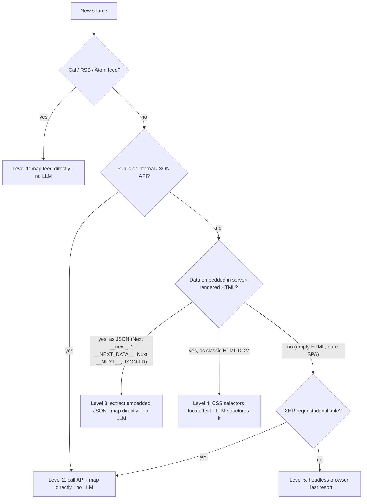

# Scraping strategy — choosing how to ingest a new source

This is the decision procedure to follow whenever a new source is added. The
goal is to pick the **most robust, cheapest** ingestion path, not merely the
first one that works. Robustness decreases and cost increases as you go down the
list, so always stop at the highest level a source supports.

Every scraper plugs into the same contract: `SourceScraper.fetch_events(client) -> list[ScreeningEvent]` (see [`io/scrapers/base.py`](../src/cine_event_bot/io/scrapers/base.py)).
*How* it produces those events is internal — only the levels below differ.

## Decision tree

| Level | Source shape                                                            | Technique                                                                 | LLM?    |
| ----- | ----------------------------------------------------------------------- | ------------------------------------------------------------------------- | ------- |
| 1     | iCal / RSS / Atom                                                       | Parse the feed, map fields                                                | No      |
| 2     | JSON API (public or internal XHR)                                       | Call it, map fields                                                       | No      |
| 3     | JSON embedded in SSR HTML (Next.js RSC, `__NEXT_DATA__`, Nuxt, JSON-LD) | Extract & parse the JSON, map fields                                      | No      |
| 4     | Classic server-rendered HTML                                            | `BeautifulSoup` selectors locate per-event text                           | **Yes** |
| 5     | Pure SPA, no data in HTML                                               | Identify the XHR (→ Level 2); headless browser only if nothing else works | Depends |

## Cross-cutting rules (any level)

- **Split network from parsing.** Pure `parse_*` methods are unit-tested against
  committed, trimmed real-markup fixtures; `fetch_events` only does HTTP. Tests
  never touch the network.
- **Anchor on the most stable thing.** Business JSON keys (`avpType`, `title`)
  outlast generated CSS classes (Tailwind / CSS-modules); semantic attributes
  (`data-*`, `itemprop`) outlast styling classes.
- **LLM only for genuinely unstructured data (Level 4).** Running it over
  already-structured JSON wastes tokens and reintroduces hallucination and
  non-determinism — a regression. See [ADR 0004](decisions/0004-rsc-extraction-and-pipeline.md).
- **Fail loudly in tests, softly in prod.** A schema change must break a parsing
  test (the early-warning signal); at runtime the scraper logs a warning and
  returns `[]` so one broken source never aborts the pipeline.
- **Be a good citizen.** Respect `robots.txt`/ToS, send an identifiable
  User-Agent, fetch sequentially (these culture sites have low volume).

## Current source classification

| Source                    | Level | Status      | Notes                                                                          |
| ------------------------- | ----- | ----------- | ------------------------------------------------------------------------------ |
| La Cinémathèque française | 4     | Implemented | Homepage `a.event` → `/seance/` detail pages → text → LLM                      |
| Première Projo            | 3     | Implemented | Next.js RSC JSON; `avpType` = `AVP`/`AVPE` (team present) → direct map, no LLM |
| Forum des images          | 4     | Pending     | Classic HTML; mirrors the Cinémathèque text+LLM pattern                        |
| Sortir à Paris            | 4     | Pending     | Editorial articles (+ one JSON-LD block); noisiest, tackled last               |

## Worked examples

- **Level 3 — Première Projo.** The homepage server-renders screenings as JSON
  inside `self.__next_f.push([1,"…"])`. The scraper concatenates the decoded RSC
  chunks, finds the movies `data` array, and maps each show straight to a
  `ScreeningEvent` — `avpType == "AVPE"` sets `has_team_present`, the ISO date is
  converted to UTC. No LLM. See
  [`premiereprojo.py`](../src/cine_event_bot/io/scrapers/premiereprojo.py).
- **Level 4 — La Cinémathèque.** Screenings are plain HTML cards; the scraper
  gathers each detail page's text (venue, cycle, date, film) and the injected
  `EventExtractor` (LLM) structures it. See
  [`cinematheque.py`](../src/cine_event_bot/io/scrapers/cinematheque.py).
